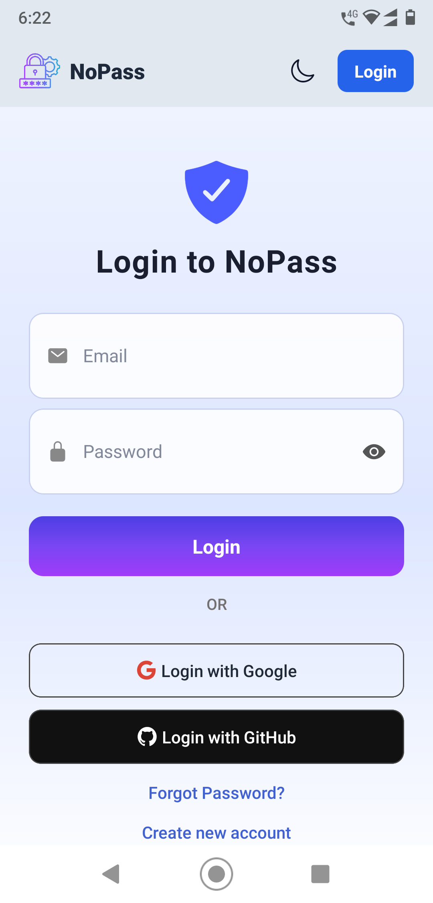
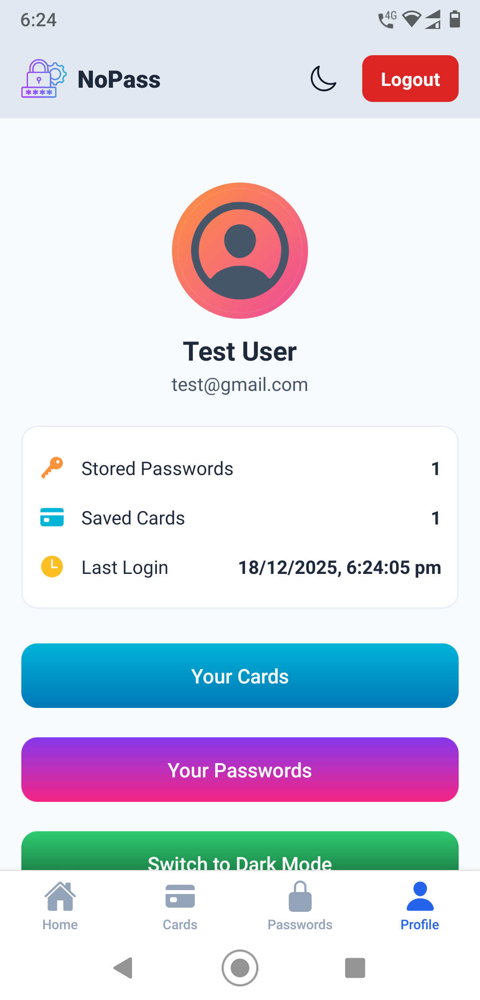
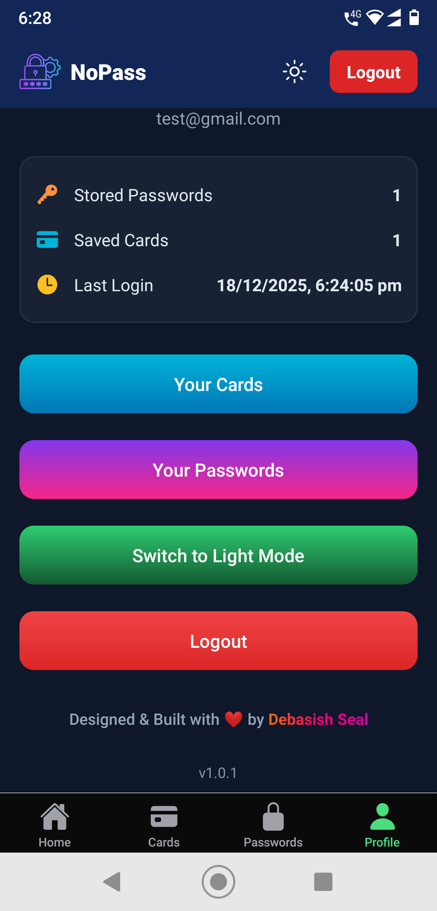

# 🔐 NoPassMobile

NoPassMobile is the official **Android mobile application** for the **NoPass Password Manager** project.  
It allows users to securely **store, view, and manage their passwords and credit or debit card details** using modern security best practices.

> 🚀 This repository contains the complete source code of the NoPassMobile app.  
> The latest production APK (v1.0.1 – Stable Release) can be downloaded from the **GitHub Releases** section.

---

## ✨ Features

- 🔑 Secure Password Manager
- 🔐 Strong encryption for sensitive data
- 👤 User authentication (Email/Password, OAuth – backend dependent)
- 📋 One-tap copy to clipboard
- 📱 Clean & modern UI (React Native + Expo)
- ⚡ Fast and lightweight
- 🌐 Works with the **[NoPass Backend API](https://github.com/2000Deba/NoPass)**

---

## 📱 App Screenshots

<p align="center">
  
  
</p>
<p align="center">
  <b>Home Screen</b> &nbsp;&nbsp;&nbsp;&nbsp;&nbsp;&nbsp;&nbsp;&nbsp;
  <b>Login Screen</b>
</p>

<p align="center">
  
  
</p>
<p align="center">
  <b>Dashboard</b> &nbsp;&nbsp;&nbsp;&nbsp;&nbsp;&nbsp;&nbsp;&nbsp;
  <b>Dark Mode</b>
</p>

---

## 🔐 Security & Safety

This application is developed with security best practices in mind.

During installation, the APK is scanned by **Google Play Protect**.
No harmful behavior was reported during the scan.

<div align="center">
  <p><strong>Google Play Protect – Installation Scan Result</strong></p>
  
</div>

> This application is not distributed via the Google Play Store.
Google Play Protect scanning occurs automatically during APK installation on supported Android devices.

### Security Notes

- **Sensitive data is never stored in plain text in the database**

- **Data is encrypted on the backend before being stored in the database**

- **Encrypted data is decrypted on the backend only when required**

- **The database never contains raw passwords or secrets**

- **Environment variables and encryption keys are never committed to the repository**

---

## 🛠️ Tech Stack

### Mobile App
- **React Native**
- **Expo**
- **TypeScript**
- **Expo Router**
- **Context API** (State management)

### Backend (Separate Repository)
- **Next.js**
- **NextAuth**
- **MongoDB**
- **REST APIs**

---

## 📦 Installation (Development)

### 1️⃣ Clone the repository
```bash
git clone https://github.com/2000Deba/NoPassMobile.git
cd NoPassMobile
```
### 2️⃣ Install dependencies
```
npm install
```
### 3️⃣ Start the development server
```bash
npx expo start
```

---

## 🧪 Build APK (Local)

### Using Expo CLI:
```bash
npx expo prebuild
npx expo run:android
```
### Using EAS Build:
```bash
npm install -g eas-cli
eas build -p android
```

---

### 🚀 Releases

➡️ Download the **latest APK** from the **Releases** section of this repository.

- **Latest version:** v1.0.1 – Stable Release
- **Platform:** Android
- **Minimum supported version:** Android 8+
- **Tested on:** Android 10+

---

### 👨‍💻 Author

**👤 Debasish Seal**

- GitHub: [@2000Deba](https://github.com/2000Deba)
- Live Demo: [NoPass](https://nopass-deba.vercel.app/)
- Download: [Latest APK (GitHub Releases)](https://github.com/2000Deba/NoPassMobile/releases)

---

### ⭐ Support

If you find this project useful, please consider giving it a ⭐ star.

For bugs or feature requests, feel free to open an issue.